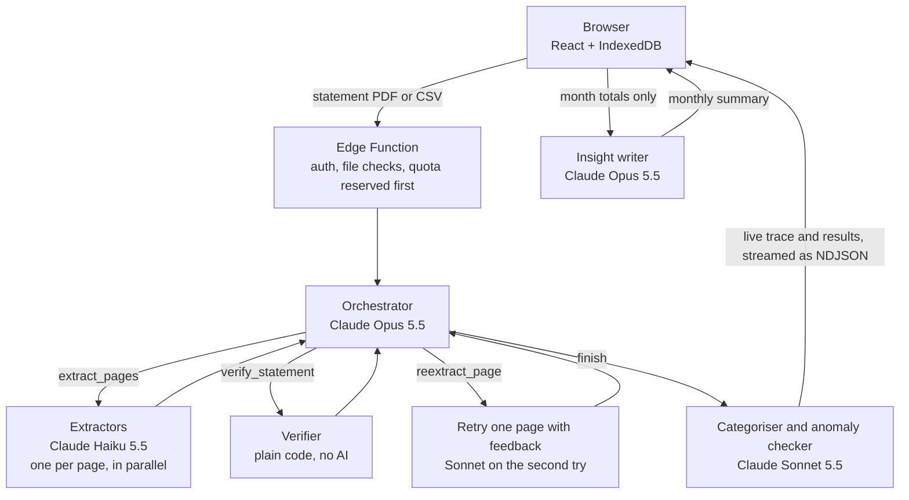

# Finance Tracker

A personal finance tracker where a team of Claude agents reads your bank, card or e-wallet
statements. Upload a PDF or CSV from any bank and the agents extract every transaction, check the
numbers reconcile, sort them into categories, flag anything unusual and summarise your month.

Live site: https://finance-tracker-1k3.pages.dev/

No account needed. Click **Try the demo** to explore four sample statements and replay a real agent
run. The demo makes no AI calls.

## Contents

- [Highlights](#highlights)
- [How it works](#how-it-works)
- [Evals](#evals)
- [Security and privacy](#security-and-privacy)
- [Tech stack](#tech-stack)
- [Running locally](#running-locally)
- [Project structure](#project-structure)

## Highlights

- **Hand-written multi-agent pipeline.** An Opus orchestrator runs its own tool-use loop, sends
  pages to Haiku extractors in parallel, retries failed pages with feedback and hands off to a
  Sonnet categoriser. No agent framework.
- **Code checks the maths, not the model.** A deterministic verifier reconciles running balances,
  printed totals and opening + movements = closing. The orchestrator can't overrule it.
- **Measured with evals.** 20 synthetic statements with known answers: 1,034/1,034 transactions
  exact, 95.9% of categories correct, 4/4 injected duplicates caught, about US$0.05 per statement.
- **Private by design.** Statements are processed in memory and discarded. Transactions stay in
  the user's browser (IndexedDB); the server only keeps anonymous usage counters.
- **Safe to leave public.** Bot checks, per-user limits and a global daily spending cap, enforced
  atomically in Postgres.
- **Live agent trace.** Every run streams each agent's steps, model and token use, and can be
  replayed later.

## How it works



Design decisions:

- **Right model for each job.** Haiku does the bulk reading, Sonnet the judgement calls, Opus the
  planning and the summary.
- **CSVs: the model maps the columns, code parses the rows.** Haiku sees the header and 20 sample
  rows and returns a column mapping. A 260-row file went from 187s and US$0.37 to 49s and US$0.12,
  with every row exact.
- **Guardrails in code.** A turn limit, per-page retry limit and per-run budget stop a confused
  agent from looping.
- **Minimal data to the models.** The categoriser and insight writer only see totals and merchant
  names. Account numbers are masked to their last 4 digits.
- **Prompt injection can't trigger actions.** Extractors have no tools and a strict output schema,
  so a malicious statement can at worst produce wrong numbers, which the verifier catches.
- **Corrections carry over.** Recategorise a transaction and you can apply it to every transaction
  from that merchant or account, including future uploads.

## Evals

`evals/` has 20 synthetic statements in four layouts (two bank styles, a credit card and a
PayPal-style CSV) with known answers, including ones built to fail verification and ones with
injected duplicate charges.

| Metric | Result |
|---|---|
| Transactions extracted exactly (date, signed amount, printed balance) | 100% of 1,034 |
| Transaction count correct | 20 / 20 statements |
| Verification outcome correct (verified, unverified or failed) | 20 / 20 |
| Category accuracy | 95.9% |
| Injected duplicate charges flagged | 4 / 4 |
| Average cost and time | US$0.046 and 32s per statement |

Full results: [evals/REPORT.md](evals/REPORT.md). The bugs the evals caught (like negative balances
breaking the verifier) and the known weaknesses are in [docs/eval-findings.md](docs/eval-findings.md).

## Security and privacy

Anyone with the link can use the app, so the goals are to keep statements private and stop bots
from running up the API bill.

- Cloudflare Turnstile bot check before an anonymous session is created
- Every token verified with the auth server
- File type checked by its bytes, 10 MB and 30 page limits
- 3 uploads per user per month, reserved before any Claude call
- One run at a time per user (unique partial index)
- A daily spending cap across all users, counting runs still in progress
- Each limit is one conditional `UPDATE` in a transaction, so racing requests can't slip past
  (tested with 20 parallel requests and 10 users racing)
- Usage tables in a private schema the public API can't reach

The tests were checked by deliberately breaking each control and confirming the matching test
failed. Details: [docs/security.md](docs/security.md).

## Tech stack

| Area | Tools |
|---|---|
| Frontend | React 19, TypeScript, Vite, Tailwind CSS v4, hand-drawn SVG charts |
| Browser storage | IndexedDB via Dexie, with backup and restore |
| Backend | Supabase Edge Functions (Deno), Postgres, anonymous Auth |
| AI | Claude API via the official TypeScript SDK (tool use, structured outputs) |
| Hosting | Cloudflare Pages, hosted Supabase |
| Testing | Vitest unit and security tests, paid eval suite |

## Running locally

Needs Node 22.18+ (developed on 24), Docker Desktop and an Anthropic API key.

```bash
npm install
npx supabase start
cp supabase/functions/.env.example supabase/functions/.env   # add your ANTHROPIC_API_KEY
cp supabase/.env.example supabase/.env
cp .env.example .env.local                                    # add the publishable key from `npx supabase status`
npm run functions:serve    # terminal 1
npm run dev                # terminal 2
```

| Command | What it does |
|---|---|
| `npm test` | unit and security tests (no AI calls, needs local Supabase) |
| `npm run build && npm run preview` | production build with the production security headers |
| `node scripts/fixtures/generate.ts` | regenerate the synthetic eval statements |
| `node evals/run-evals.ts` | run the evals (about US$1; `--resume` continues an interrupted run) |
| `node scripts/run-local.ts <file>` | run one statement and print the trace |
| `node scripts/build-demo.ts` | rebuild the demo data (about US$0.25) |

All sample data is synthetic; no real statements are committed. Deployment steps are in
[docs/deploy.md](docs/deploy.md).

## Project structure

```
src/
  features/              one folder per tab (dashboard, transactions, budgets, statements, upload, trace)
  lib/                   browser database, analytics, rules, demo mode
  auth/                  Turnstile and anonymous sign-in
supabase/
  functions/
    process-statement/   orchestrator, extractors, CSV mapping, verifier, categoriser
    generate-insights/   monthly summary
    _shared/             Claude client, categories, quotas, trace streaming
  migrations/            usage limits and atomic quota functions
evals/                   synthetic statements, eval runner, report
tests/                   unit and security tests
docs/                    security design, eval findings, deploy guide
```

Built by [Sheng Yiping](https://yipingsh.github.io).
